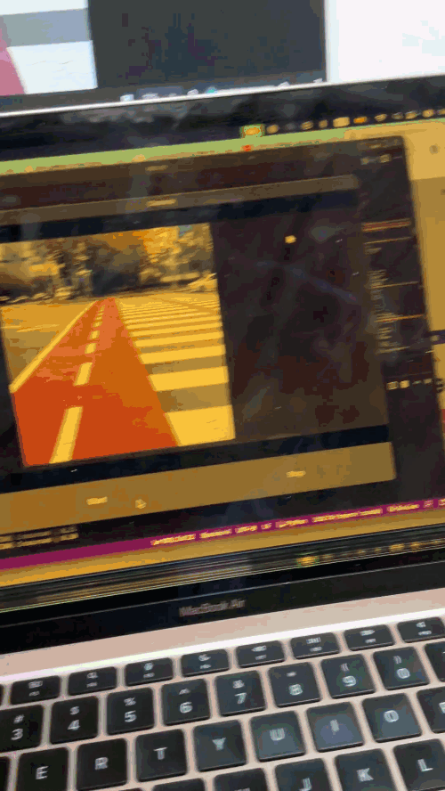

# 📱 Smart Vision App

**AI-powered real-time object detection with spoken alerts for blind and visually-impaired users.**

Built with Kivy · TensorFlow Lite · YOLOv8




---

## ✨ Features

| Feature | Details |
|---|---|
| **Real-time detection** | YOLOv8 TFLite model running at 20–30 FPS on mid-range devices |
| **Spoken alerts** | Plyer TTS announces objects in natural language ("Car ahead", "Red light, stop") |
| **Smart cooldown** | Each class has an independent cooldown timer — no repeated spamming |
| **Priority alerts** | People, crossroads, and red lights use a shorter cooldown for faster re-announcement |
| **Bounding box overlay** | Colour-coded boxes with confidence scores drawn on the live feed |
| **Threaded inference** | Model runs on a background thread — the UI never drops frames waiting for inference |
| **Offline & private** | Fully on-device; no internet connection required |
| **Clear error messages** | Missing model file produces a readable screen, not a cryptic crash |

---

## 🧠 Model

| Property | Value |
|---|---|
| Format | TensorFlow Lite (`.tflite`) |
| Input size | 640 × 640 px |
| Output shape | `(1, 30, 8400)` |
| Classes | 26 custom categories |
| Architecture | YOLOv8-style (no separate objectness score) |

### Detected classes

Bike (front/left/right) · Car (front/left/right) · Crossroad · Fence (front/left/right) ·
Pedestrian Light (green/red) · Person (front/left/right) · Pole (front/left/right) ·
Traffic Cone · Traffic Light (green/orange/red) · Trash Bin (left/right) · Tree (front/right)

---

## 📂 Project structure

```
smart-vision-app/
├── app.py            # Kivy UI, camera loop, app entry point
├── config.py         # All tuneable settings (thresholds, paths, cooldowns)
├── names.py          # Class index → label map + spoken alert phrases
├── util.py           # Preprocessing, YOLO decode, NMS, bounding-box drawing
├── requirements.txt  # Python dependencies
├── model/
│   └── best_float32.tflite   ← place your model here (not in git)
└── LICENSE
```

---

## 🛠 Installation (desktop / development)

**Requirements:** Python 3.10+

```bash
git clone https://github.com/your-username/smart-vision-app.git
cd smart-vision-app

pip install -r requirements.txt

# Place your TFLite model in the model/ directory
cp /path/to/best_float32.tflite model/

python app.py
```

> **Webcam access** — the app opens camera index `0` by default.
> Change `cv2.VideoCapture(0)` in `app.py` if you need a different index.

---

## ⚙️ Configuration

All tuneable values are in **`config.py`** — no need to touch app logic:

```python
CONF_THRESHOLD  = 0.30   # minimum detection confidence (0–1)
NMS_THRESHOLD   = 0.45   # IoU overlap threshold for NMS
TARGET_FPS      = 30     # camera polling rate
TTS_COOLDOWN    = 3.0    # seconds before the same class is announced again
PRIORITY_COOLDOWN = 1.5  # shorter cooldown for high-priority classes
```

**To add or change priority classes**, edit the `PRIORITY_CLASSES` set:

```python
PRIORITY_CLASSES = {
    "Person Front",
    "Crossroad",
    "Pedestrian Light Red",
    "Traffic Light Red",
}
```

**To customise the spoken phrases**, edit `ALERT_PHRASES` in `names.py`:

```python
"Car Front": "Car directly ahead, be careful",
```

---

## 📱 Build for Android (Buildozer)

```bash
pip install buildozer
buildozer init
```

Edit `buildozer.spec`:

```ini
source.include_exts = py,png,jpg,kv,atlas,tflite
requirements = python3,kivy,plyer,numpy,opencv-python-headless,tensorflow-lite
android.permissions = CAMERA
```

Build:

```bash
buildozer -v android debug
# APK appears in bin/
```

---

## 🍎 Build for iOS (Kivy-iOS)

```bash
pip install kivy-ios
toolchain build python3 kivy plyer
toolchain build tensorflow-lite
toolchain create smartvision app.py
toolchain xcode smartvision
```

---

## 🔧 How it works

```
Camera frame
    │
    ▼
preprocess()          BGR → RGB, resize to 640×640, normalise 0–1
    │
    ▼  (background thread)
TFLite interpreter    invoke() → raw tensor (1, 30, 8400)
    │
    ▼
parse_yolo_output()   decode cx/cy/w/h + class scores → pixel-space boxes
    │
    ▼
apply_nms()           remove overlapping duplicates
    │
    ├──► draw_detections()   annotate frame for display
    │
    └──► Announcer.speak()   TTS with per-class cooldown
```

---

## 🎯 Roadmap

- [ ] Vibration feedback for critical detections (no audio required)
- [ ] Navigation mode with distance estimation
- [ ] Voice commands ("what's in front of me?")
- [ ] Android TalkBack / Apple VoiceOver integration
- [ ] Multi-language TTS support

---

## 🤝 Contributing

Pull requests are welcome — model improvements, new alert phrases, UI work, or mobile build fixes.

---

## 📜 License

MIT — free for personal and commercial use. See [LICENSE](LICENSE).
